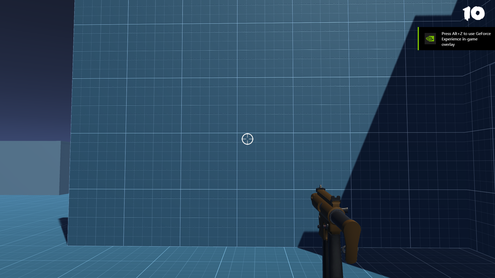
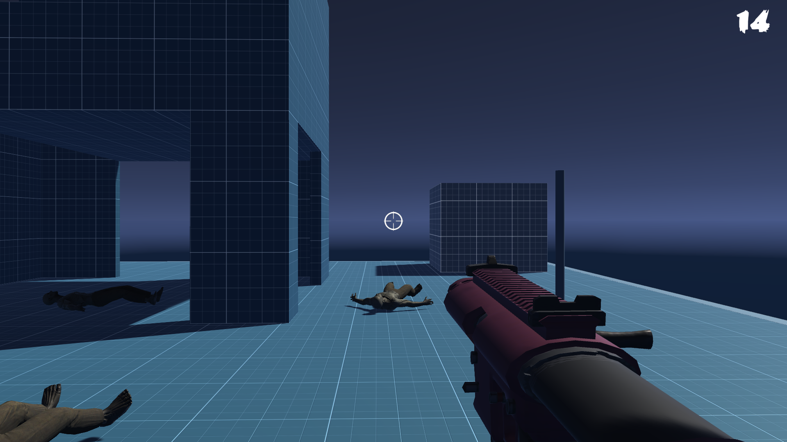
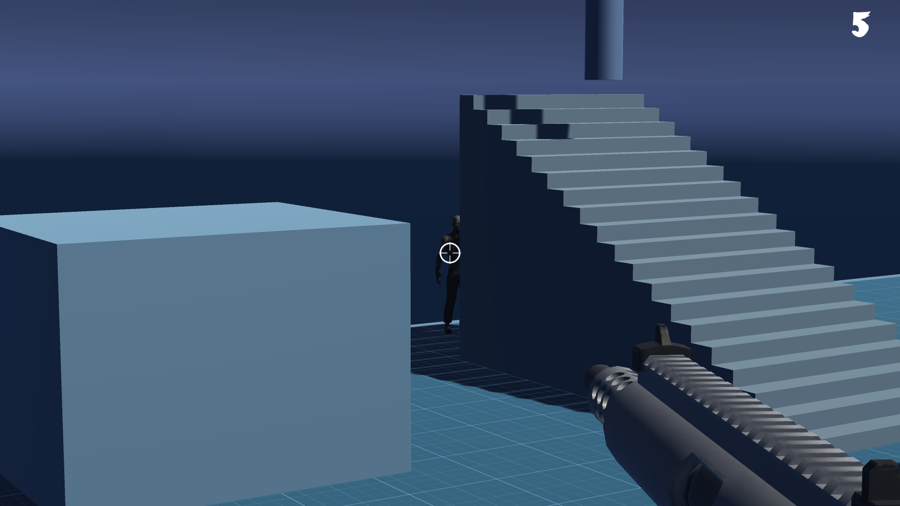
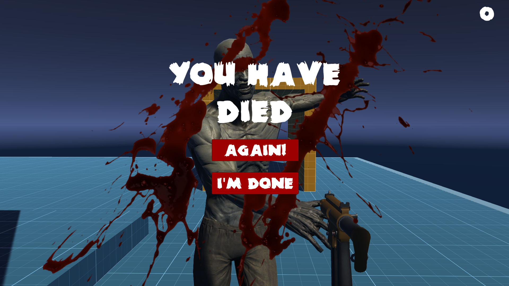

<!-- GAME PROJECT TITLE -->
# Zombie-Runner---Game
Game created for study purposes by Matheus Soares Martins, and is was created to test FPS games core mechanics, as well as enemy AI for chasing the player 
In this game you have to kill all the zombies, while avoiding getting yourself killed to win the game.
 

This game was made to be played by one player, and it uses just the mouse and keyboard to play.
 

Game Controls 
- Player controls 
Left click - Fire a bullet on the target 
Right click - Weapon Zoom(Aim) if the weapon have it
W or Up arrow - Climb up when in a ladder. 
A or Left arrow - Runs to the left. 
D or Right arrow - Runs to the right. 
S or Down arrow - Climb down when in a ladder. 
Space - Makes the character jump 

- Other controls 
Esc - Closes the game 
F11 - Toggle between fullscreen and windowed mode 
******************************************************************************

 

<!-- GAME PROJECT IMAGES -->
# Screenshots

<!-- GAME PROJECT BUILDS -->
# Game download 
## Windows: https://mega.nz/folder/gZ9hmYhD#m4G0_w7srgWgNtOtQTmwgQ
## Mac: https://mega.nz/folder/1BEHWAZR#PGlqKebcPKoU3QcBxdeGTw
## Linux:  https://mega.nz/folder/8V9lhaDC#-h0Q-6HgjahhpTnI6TFIcw